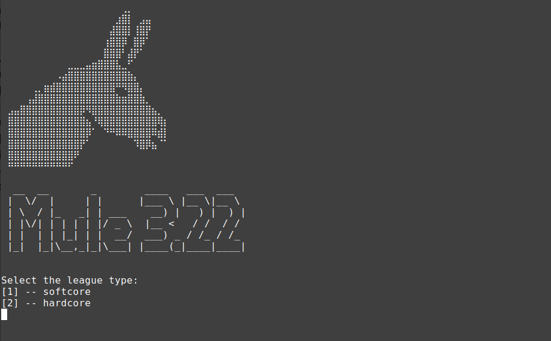

# Mule 3.22


[](https://www.python.org/downloads/)
[](https://www.gnu.org/licenses/gpl-3.0.fr.html)


## ⚠️ About
Mule is a Python script that parses poe.ninja's responses and compares prices for items in the current soft- or hardcore league with those in the standard league. The script generates an Excel file that contains the following information:

* Item id
* Item name (with possible number of links or variation name)
* Price in the current soft- or hardcore league
* Price in the standard league.
* Difference between these two.

The items in the report are only those returned by poe.ninja.

Items are sorted in the same manner as they are received from poe.ninja's API. The user is free to sort the resulting Excel file as they see fit.

ALL PRICES IN THE REPORT ARE IN CHAOS ORBS.

## ✔️ Supported items
The script is still under development and shall be considered as an MVP and not as finished product at this stage.

Price comparison for the following items is supported:
* Tattoo
* Omen
* Divination cards
* Artifacts
* Oils
* Incubators
* Unique weapons
* Unique armours
* Unique accessories
* Unique flasks
* Unique jewels
* Unique relics
* Cluster jewels

Other items are added 

## 🛠️ Requirements / Launch
### For Windows
1. Install Python: [Python 3](https://www.python.org/downloads/). During the installation, make sure to check both checkboxes -- the first one says something about admin privivleges, the second one asks you whether you want to add python's executables to the PATH variable.
2. Download the project either by clicking `Code` > `Download ZIP` on GitHub or by running the following command:
```
$ git clone https://github.com/xxx.git
```
3. Open Windows Command Line (`cmd.exe`, Command Prompt).
4. In the command line, type the following commands to install the script's dependencies.
```
$ cd C:\path-to-the-folder-where-the-mule-py-is-located
$ pip install -r requirements.txt
```

You can just copy the path to the mule.py folder from the Explorer. If the path includes whitespaces, use quotation marks:
```
$ cd "C:\path to the folder where the mule py is located"
```
5. After the dependencies have been installed, you can launch the script either from the command line by typing
```commandline
mule.py
```
or by just double clicking on the script.